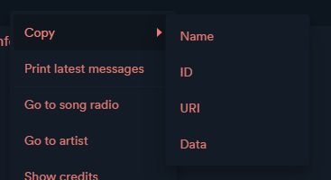

# Extended copy

Copy the name, ID, URI or raw data of the selected element(s) to the clipboard.

**Note:** If you're only interested in copying names, check out [this extension](https://github.com/pnthach95/spicetify-extensions) instead.

## Installation

You can install the extension from the [marketplace](https://github.com/spicetify/spicetify-marketplace).

## Usage

Simply right click on an element to open the context menu.

Supported elements:

-   Tracks
-   Playlists
-   Albums
-   Artists
-   Podcasts
-   Podcast episodes

Supported languages:

-   English
-   French
